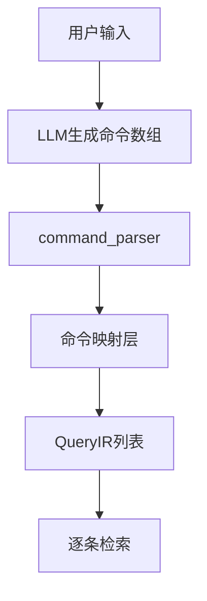

# 技术设计: 命令数组解析与检索管线重构

## 技术方案
### 核心技术
- Python 3.13
- dataclasses + typing

### 实现要点
- `command_parser` 直接解析 JSON 命令对象数组，统一处理 `a/s/n/t/q/c` 的校验与降级，移除 legacy 字符串输入与对象→字符串桥接。
- `s` 解析支持通配 `*`、逗号分隔、多排除 `!`；通配在映射时转为空 include，仅保留 exclude。
- 新增命令到 QueryIR 的映射层：
  - `a` → action
  - `s` → scope_include/scope_exclude（通配不写入 include）
  - `n` → name_hint（`*` 置空，`@last` 写入 references）
  - `t` → type_hint
  - `q` → quantifier
  - `c` → count（落入 QueryIR.meta 或 CommandRetrieval.meta）
- `ir_compiler` 不再持有系统提示词；调用侧注入 `command_parser.prompt.DEFAULT_SYSTEM_PROMPT`。
- `pipeline.retrieve` 统一返回 MultiRetrievalResult，按命令顺序逐条检索；新增 `retrieve_single` 作为显式单命令兼容入口。

## 架构设计

## 架构决策 ADR
### ADR-001: 多命令逐条检索与统一返回结构
**上下文:** LLM 输出为命令数组，单命令检索会丢失语义顺序。
**决策:** 逐条构建 QueryIR 并检索，`retrieve` 统一返回 MultiRetrievalResult；新增 `retrieve_single` 作为显式单命令兼容入口。
**理由:** 语义准确性优先，避免动态返回类型导致调用方脆弱。
**替代方案:** 仅取第一条命令或动态返回类型 → 语义丢失或类型不稳定。
**影响:** 检索返回结构需要调整并更新测试与文档。

## 安全与性能
- **安全:** 严格 JSON 解析与字段校验，失败统一降级并记录日志。
- **性能:** 解析阶段仅做一次 JSON 处理，检索按命令分批执行。

## 测试与部署
- **测试:** 单元测试覆盖解析、映射与多命令返回结构；集成测试覆盖 DashScope 命令数组契约与检索主路径。
- **部署:** 无需迁移数据，按现有流程发布。
