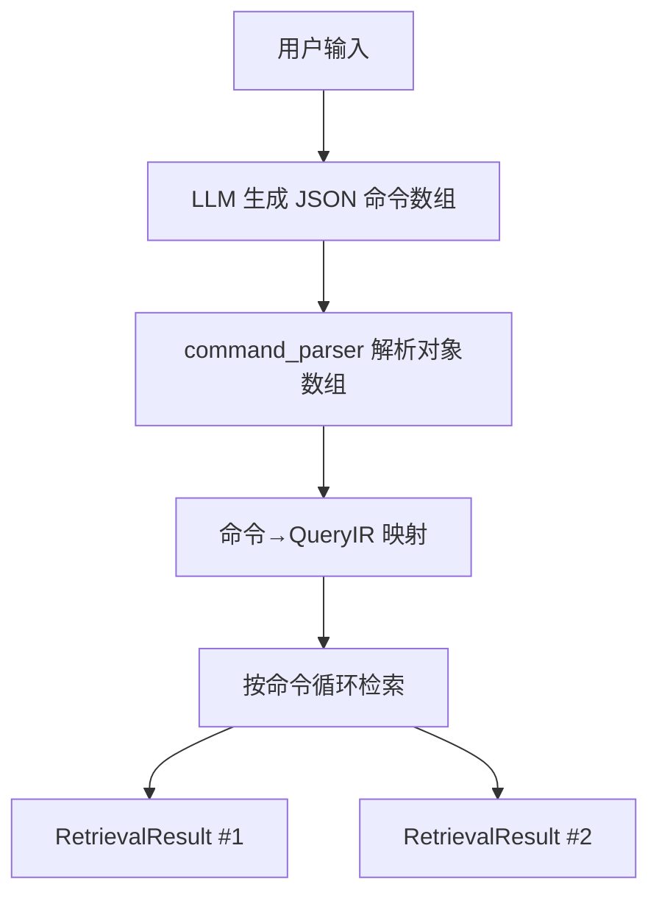

# 技术设计: 命令数组驱动的检索管线重构（含房间 scope 硬过滤回退与设备名兜底）

## 技术方案

### 核心技术
- Python 3.13
- dataclasses + typing
- 现有 keyword/vector/bulk 检索模块复用

### 实现要点
- 以 `command_parser.prompt.DEFAULT_SYSTEM_PROMPT` 作为唯一协议入口，LLM 输出 JSON 命令数组。
- `command_parser` 对对象数组直接解析为结构化命令（避免对象→字符串桥接导致的语义偏差）。
- `pipeline.retrieve()` 返回 `list[RetrievalResult]`，每条命令独立检索且顺序一致。
- scope 语义：
  - `exclude` 永远硬过滤；
  - `include` 先硬过滤，结果为空则回退为“仅排除”；
  - 设备名房间提取仅在“冲突/未知”场景启用（最长匹配，多命中不确定）。
- 多命令时向量索引只构建一次，复用 spec lookup 与索引结果。
- 回退与兜底使用情况写入 `RetrievalResult.meta` 以便观测回归。
- 不引入房间映射表与向量相似映射；未知房间仅尝试设备名兜底匹配，失败则回退。

## 架构设计

## 架构决策 ADR

### ADR-001: 命令数组作为唯一协议入口
**上下文:** 命令数组与 QueryIR JSON 并存导致入口不一致与维护成本上升。
**决策:** `pipeline.retrieve()` 直接生成并消费命令数组，QueryIR 仅作为检索侧内部结构。
**理由:** 协议统一、可维护性更强、天然支持多命令序列。
**替代方案:** 保留 QueryIR JSON 入口 → 拒绝原因: 需要长期维护两套协议与测试。
**影响:** `retrieve()` 返回类型改为列表；测试与文档需同步迁移。

### ADR-002: include 硬过滤但必须回退
**上下文:** `Device.room` 不一定可靠，硬过滤容易误杀。
**决策:** include 先硬过滤，若结果为空则回退为“仅排除”。
**理由:** 兼顾命令约束与数据鲁棒性。
**替代方案:** include 永远硬过滤 → 拒绝原因: 脏数据场景下误杀风险高。
**影响:** 需要记录回退信息，便于观测与回归。

### ADR-003: 设备名房间提取仅在冲突/未知时启用
**上下文:** 设备名子串匹配常态启用会扩大噪声。
**决策:** 仅当 (1) 设备房间字段为空或与设备名冲突，或 (2) 命令房间词不在已知房间集合中 时启用。
**理由:** 减少误匹配，提升可控性。
**替代方案:** 常态启用 name 房间提取 → 拒绝原因: 会放大误过滤风险。
**影响:** 需要明确冲突/未知判定边界与测试覆盖。

## API设计

### `context_retrieval.pipeline.retrieve`
- **请求:** `retrieve(text, devices, llm, state, top_k=5, vector_searcher=None)`
- **响应:** `list[RetrievalResult]`（按命令顺序返回；解析失败返回单元素列表并在 meta 中标记降级）

## 安全与性能
- **安全:** 严格 JSON 解析；失败统一降级为 UNKNOWN 命令；不抛未处理异常。
- **性能:** 向量索引与 spec lookup 在多命令中复用；避免重复构建。

## 测试与部署
- **测试:**
  - command_parser：对象数组解析、scope 通配/排除、多命令顺序、降级路径。
  - pipeline：多命令列表返回、include 回退、设备名兜底、索引复用。
  - bulk：量词 all/except 在新入口下保持一致。
  - DashScope 集成：命令数组契约与 pipeline recall 逻辑保持基准。
- **部署:** 无数据迁移；以单元与集成测试回归为主。

## 细节设计（避免实现偏差）

### 1) 房间词表构建（决定误匹配上限）
- **基础词表:** `rooms_vocab = unique(non_empty(Device.room))`
- **增量词表:** 把当前命令里的 `include_rooms`、`exclude_rooms` 并入（即便不在 `Device.room` 中）
- **过滤规则:** 丢弃长度为 1 的中文词；长度为 2 的词按数据分布保守启用

### 2) 标准化（避免全角/空格/括号造成漏匹配）
- 对 `Device.name` 与 `rooms_vocab` 做同样的轻量清洗：
  - 去空白、统一中英文括号与常见连字符
  - 连续空白压缩为单空格
- **不做同义词归一化**（避免引入映射表语义膨胀）

### 3) 匹配策略（最长优先 + 非重叠 + 不确定则放弃）
- 在 `Device.name` 中查找所有出现的房间词（子串匹配即可）
- **最长优先:** 同时命中“卧室”和“主卧室”时取“主卧室”
- **非重叠选择:** 避免同一段文本被多次计入
- **结果判定:**
  - 命中 0 个：提取失败（None）
  - 命中 1 个：提取成功（唯一房间词）
  - 命中 ≥2 个：视为不确定（None，不用于硬过滤）

### 4) 冲突/未知判定（决定是否启用设备名兜底）
- **设备层冲突:** `Device.room` 为空，或设备名命中房间词且与 `Device.room` 不一致
- **命令层未知:** `rooms_cmd` 中存在不在 `rooms_known` 的词
- **启用兜底条件:** 设备层冲突 **或** 命令层未知
- **明确不采用:** 房间映射表与向量相似映射（未知房间仅靠设备名兜底）

### 5) include/exclude 的使用方式（与硬过滤回退对齐）
- **exclude:** 若提取房间词在 `exclude` 中则直接剔除；提取失败时不靠 name 排除（保持保守）
- **include:** 尝试只保留 `提取房间词 ∈ include` 的设备；若过滤后为空则回退到“仅排除后的结果”

### 6) 过滤执行流程（include 硬过滤回退）
1. **exclude 硬过滤**
   - 若 `Device.room` 可信且在 `exclude_rooms` → 剔除
   - 若启用兜底且设备名提取结果在 `exclude_rooms` → 剔除
2. **include 硬过滤（仅当 include 非空且不含 `*`）**
   - 若 `Device.room` 可信且在 `include_rooms` → 保留
   - 若启用兜底且设备名提取结果在 `include_rooms` → 保留
3. **回退策略**
   - 若 include 过滤后结果为空 → 回退到“仅执行 exclude 后的结果”
   - 在 `RetrievalResult.meta` 记录 `scope_include_fallback=1`

### 7) 可观测性建议
- `room_name_used`: 使用设备名兜底的设备数
- `room_name_ambiguous`: 设备名多命中导致不确定的设备数
- `room_unknown_terms`: 命令层未知房间词列表（便于排查数据问题）
