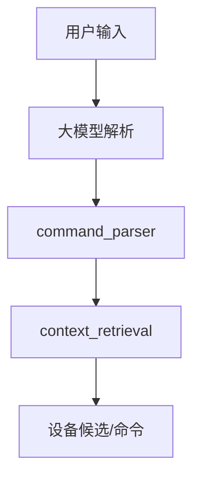
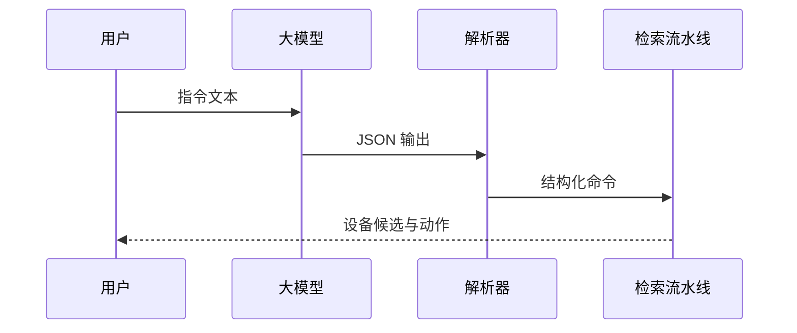

# 架构设计

## 总体架构

```mermaid
flowchart TD
    A[用户输入] --> B[大模型解析]
    B --> C[command_parser]
    C --> D[context_retrieval]
    D --> E[设备候选/命令]
```

## 技术栈
- **后端:** Python
- **外部服务:** DashScope（大模型与向量检索）
- **数据处理:** numpy, rapidfuzz, pyyaml

## 核心流程

```mermaid
sequenceDiagram
    participant User as 用户
    participant LLM as 大模型
    participant Parser as 解析器
    participant Pipeline as 检索流水线
    User->>LLM: 指令文本
    LLM->>Parser: JSON 输出
    Parser->>Pipeline: 结构化命令
    Pipeline-->>User: 设备候选与动作
```

## 重大架构决策
暂无记录。
